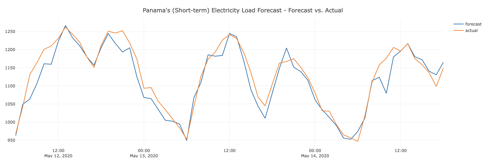

# Panama (Short-term) Electricity Load Forecast

## Problem Statement

The national electricity grid operator<sup>1</sup> in Panama requires a Machine Learning (ML) model to forecast the
hourly
electricity demand<sup>2</sup> for a period of 7 days. This goes into a pre electricity dispatch<sup>3</sup> report
released to the
electricity industry.
A dataset is available with hourly records. Its composition is as follows:

1. Historical electricity load, available on daily post-dispatch reports, from the grid
   operator ([CND](https://www.cnd.com.pa/), Panama).
2. Historical weekly forecasts available on weekly pre-dispatch reports, also from CND.
3. Calendar information related to school periods, from Panama's Ministry of Education.
4. Calendar information related to holidays, from "When on Earth?" website.
5. Weather variables, such as temperature, relative humidity, precipitation, and wind speed, for three main cities in
   Panama, from Earthdata.

Using this dataset, develop an ML model to forecast the electricity demand for a 1-hour time window when a feature
vector
for the same time window is provided.

*<sup>1</sup> The operating body who ensures the supply-demand equilibrium in the national electricity grid.*

*<sup>2</sup> The amount of electricity 'demanded' by the consumers for a specific time window. In this dataset the time
window is 1 hour. Also known as the *Load*. These two terms are use interchangeably throughout this document and the
jupyter notebook.*

*<sup>3</sup> Dispatch is the action of supplying electricity to the grid to meet the demand. This is done by
electricity
generators. An instruction given by the grid operator to a Generator (a firm supplying electricity to the grid), with
specific instructions on how much to generate and when, is known as a Dispatch Instruction.*

### Dataset

Aguilar Madrid, Ernesto (2021), “Short-term electricity load forecasting (Panama case study)”, Mendeley Data, V1, doi:
10.17632/byx7sztj59.1
(https://data.mendeley.com/datasets/byx7sztj59/1)

## Solution



The solution consists of the following components:

* [`notebook.ipynb`](notebook.ipynb) - A jupyter notebook that consists of an EDA of the dataset, model training, tuning
  and selection.
* [`predict.py`](predict.py) - A REST service API for the model so the clients (e.g. the grid operators) can get
  predictions calculated for a given set of
  features, over http. This service is hosted in Google Cloud Run (GCR) and can be accessed
  by https://load-forecast-regressor-cloud-run-service-mqpvakdd5a-ue.a.run.app/#/Service%20APIs/load_forecast_regressor__forecast
  . Here's a sample request (feature vector) to the service if you would like to manually test a forecast via the
  Swagger UI.
    ```json
    {
      "t2m_toc": 25.6113220214844,
      "qv2m_toc": 0.01747758,
      "tql_toc": 0.043762207,
      "w2m_toc": 15.885400482402956,
      "t2m_san": 23.8613220214844,
      "qv2m_san": 0.016439982,
      "tql_san": 0.03894043,
      "w2m_san": 6.2321456709303815,
      "t2m_dav": 22.9472595214844,
      "qv2m_dav": 0.01531083,
      "tql_dav": 0.062301636,
      "w2m_dav": 3.6011136954933645,
      "holiday_id": 0.0,
      "holiday": 0.0,
      "school": 0.0,
      "dt_year": 2019.0,
      "dt_month": 1.0,
      "dt_day": 8.0,
      "dt_hour": 20.0
    }
    ```
* [`train.py`](train.py) - A script to train the final model (best performing) and export as a BentoML package.
* [`shared_func.py`](shared_func.py) - A shared module that contains a function to train the XGBoost model, so it can be
  called from `notebook.ipynb` and `train.py`.
* [`dashboard/app.py`](dashboard/app.py) - https://lf-dashboard-mqpvakdd5a-uc.a.run.app is an experimental dashboard
  I've developed to visualise the forecast vs. actual demand on a graph. This dashboard sends a request to the ML model
  hosted in GCR every 2 seconds and plots the *forecast* value along with
  the corresponding *actual*.

Other files:

* [`bentofile.yaml`](bentofile.yaml) - A Bentoml descriptor to build, package and dockerize the application to a
  deployable unit.
* [`deployment_config.yaml`](deployment_config.yaml) - A configuration descriptor for `bentoctl` to deploy the service (
  which is defined in `predict.py` and encapsulated in a BentoML package) to GCR.
* `main.tf` and `terraform.tfstate` - Generated by `bentoctl` for the infrastructure to provision in GCR.
* [`NOTES.md`](NOTES.md) - My personal notes about the dataset.
* [`Makefile`](Makefile) - A convenience script to organise frequently executed commands.

## How to run the solution locally

This solution was developed on macOS platform. Pipenv is used to isolate the Python version and dependencies, and they
can be found in the `Pipfile` and `Pipfile.lock`. The entire solution can be executed locally.

1. To build the model
    ```shell
    bentoml build
    ```
2. To serve the model.
    ```shell
    bentoml serve predict.py:load_forecast_svc
    ```
   Once started, direct your browser to http://0.0.0.0:3000 to view the Swagger UI.
3. Build the dashboard
    ```shell
    docker build -t lf-dashboard ./dashboard/.
    ```
4. Run the dashboard
    ```shell
    docker run -it --rm -p 8050:8050 lf-dashboard
    ```
   Once started, direct your browser to http://0.0.0.0:8050 to view the dashboard. Note that the dashboard is hardcoded
   to connect to the model hosted in GCR. If you would like the dashboard to connect to the model you started locally,
   please update serve url in `dashboard/app.py`.
    ```python
    url = 'http://0.0.0.0:3000/forecast'
    ```

**Running notebook on Colab or Kaggle?**

1. Download notebook.ipynb and upload to the online jupyter platform of choice
2. In the notebook, search for this import statement and comment it out: `from shared_func import train_gb_model`
3. Copy the content from [`shared_func.py`](shared_func.py) and insert in a cell right after the cell where the import
   statements are.
4. Add the following statement as the first cell under the section _Exploratory Data Analysis (EDA)_.
   ```!wget -P data -nc 'https://raw.githubusercontent.com/kausnz/panama-electricity-load-forecast/main/data/continuous_dataset.csv'```

You should now be able to run the notebook successfully.

## Having trouble?

If you run into any issues when executing the solution, please reach out to me via
MLZoomcamp Slack (user @Kaush S.).
